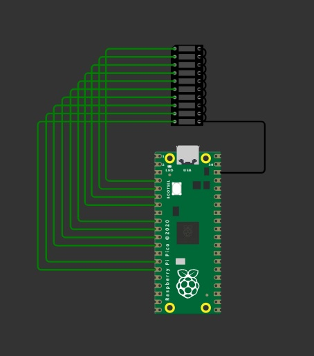
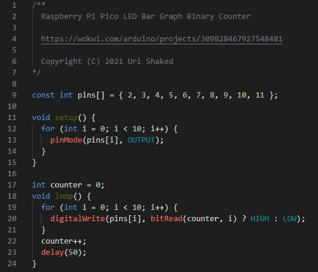

<pre>

	

Tecnológico Nacional de México
Instituto Tecnológico de Tijuana

Departamento de Sistemas y Computación
Ingeniería en Sistemas Computacionales

Semestre:
Febrero - Junio 2022

Materia:
Sistemas Programables

Docente:
M.C. Rene Solis Reyes 

Unidad:
1

Título del trabajo:
SPB32-Exposicion-Led-Bar-Graph

Alumno:
Dominguez Garcia Jesus Roman - 17212123

	

</pre>

# SPB32-Exposicion-Led-Bar-Graph

# Acerca del sensor LED BAR GRAPH
El sensor LED BAR GRAPH, que no es mas que un Led que funciona como una grafica de barras, debido a que es un
sensor que contiene una serie de leds en una linea, que enciende sus leds para simular que es una grafica de barras. 
Cuenta con una entrada analogica como un potenciometro.

Esto puede tener varios usos, como por ejemplo, indicar que tan alta es la temperatura dentro de un rango dado o usarlo como si fuera una barra de progreso.

# Diagrama
En la siguiente imagen se muestra el circuito que se explicara mas adelante, el cual cuenta con la placa Raspberry Pi Pico y un sensor
LED BAR GRAPH, ademas de las conexiones necesarias. 

Para realizar el diagrama que se observa en la imagen se uso la pagina Wokwi, la cuela cuenta con un 
simulador para realizar practicas y preubas con sensores. El link del diagrama correspondiente a esta exposicion es el siguiente: 
https://wokwi.com/projects/309828467927548481

# Código

/**
  Raspberry Pi Pico LED Bar Graph Binary Counter

  https://wokwi.com/arduino/projects/309828467927548481
  
  Copyright (C) 2021 Uri Shaked
*/

const int pins[] = { 2, 3, 4, 5, 6, 7, 8, 9, 10, 11 };

void setup() {
  for (int i = 0; i < 10; i++) {
    pinMode(pins[i], OUTPUT);
  }
}

int counter = 0;
void loop() {
  for (int i = 0; i < 10; i++) {
    digitalWrite(pins[i], bitRead(counter, i) ? HIGH : LOW);
  }
  counter++;
  delay(50);
}

